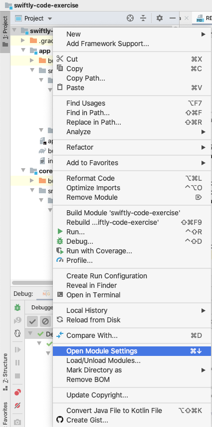
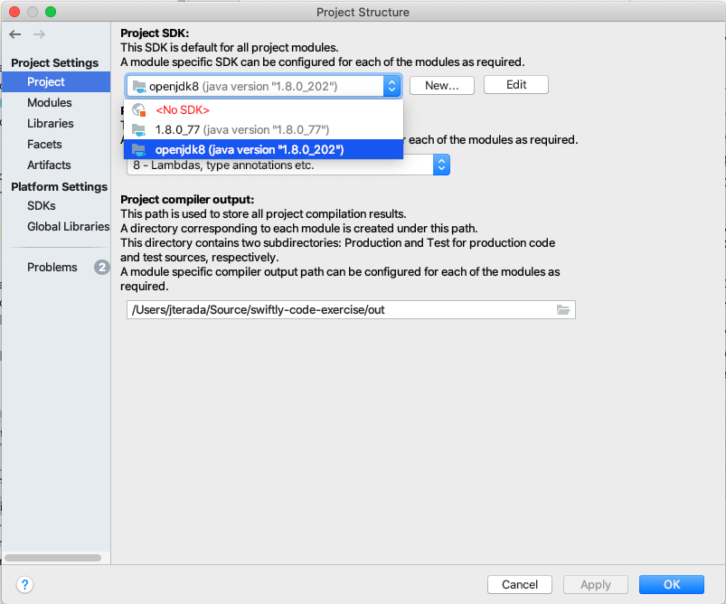

# Swiftly Code Exercise Submission
Author: Justin Terada

## Summary
This project is to read lines of grocery input from a file and create objects that will
be consumed by another service to write to a database.

## Running the program
### Prerequisites
You need to have a version of Java 8 installed. Oracle's Java 8 is available at [here](https://www.oracle.com/technetwork/java/javase/downloads/jdk8-downloads-2133151.html).
Instructions on how to install OpenJDK on Linux is available [here](http://openjdk.java.net/install/index.html).
OpenJDK can be installed on a Mac by using HomeBrew using the AdoptOpenJDK cask [here](https://github.com/AdoptOpenJDK/homebrew-openjdk).

The command line application takes one argument, the file that should be ingested. It is relative to where
the application is being run.

### With the included sample file
To run the program, do the following:

1. Clone the git repository
2. Run `./gradlew app:run --args="./input-sample.txt"`
    * If on a windows machine, use `gradlew.bat app:run --args="./input-sample.txt"` 

### With your own file
When the app is run from the command line using Gradle, the working directory is `/app`. The argument
that you pass for the file to ingest must be relative to that directory.

## Structure
This repository is broken into two Gradle projects, `core` and `app`. Core consists
of all the code for parsing an input stream and converting the parsed values to ProductRecord objects. 
App is a sample application that uses core to read a file from disk and print the output to
system out.

## Running tests
All of the tests of the project can be run using gradle by running the command `./gradlew check`. Individual
tests can be run in IntelliJ using the TestNG plugin.

## Opening the project in IntelliJ
To open this project in IntelliJ, run `./gradlew openIdea`.
If you later need to rebuild the IntelliJ project if you add a dependency, run `./gradlew cleanIdea idea`.
You may need to select the JDK version after you open the project by going to Module Settings for the main `swiftly-code-exercise`
module:

